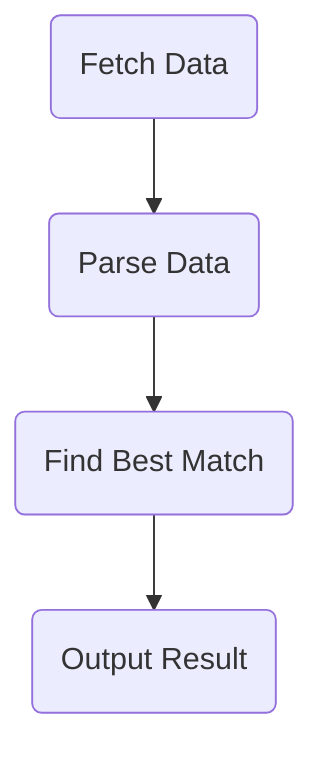

# Parking

This repository shows how to decouple an application by using different messaging patterns.

The application is a simple program that fetches car park data from a url, parses it, works out the best car park to park at, and outputs the result.

The simplest form of the application uses no messaging and is shown in the [NoFramework](NoFramework) implementation.

Other implementations use different messaging libraries to show how to decouple the application.
Some libraries have multiple implementations to show different messaging patterns.

The libraries used are:

- [Akka.NET](https://github.com/akkadotnet/akka.net) (implementations: [Ask](Akka.Ask), [Tell](Akka.Tell))
- [Brighter Command](https://github.com/BrighterCommand) (implementations: [Brighter](Brighter.Brighter), [Darker](Brighter.Darker))
- [MediatR](https://github.com/LuckyPennySoftware/MediatR) (implementations: [Publish](MediatR.Publish), [Send](MediatR.Send))
- [MicroBus](https://github.com/daniellittledev/Enexure.MicroBus) (implementations: [Query](MicroBus.Query), [Send](MicroBus.Send))
- [Shiny](https://github.com/shinyorg/mediator) (implementations: [Publish](Shiny.Publish), [Request](Shiny.Request), [Send](Shiny.Send))
